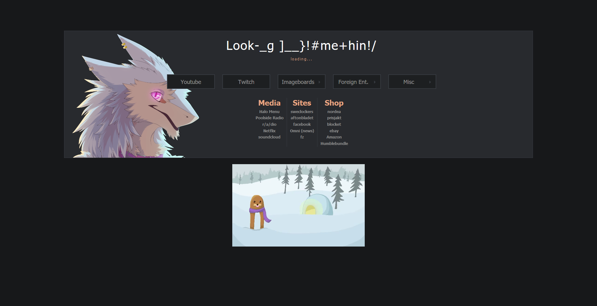

Homepage
====



This repository contains a custom homepage made using html, css and javascript (jQuery).

Features:
* Flashy links
* Flashy Slidy sublinks
* Randomly selected 2D characters
* Column style links.

Customizing, adding mascots and themes
----

To customize mascots in `ruri-dark` theme, modify the array in [themes/ruri-dark/mascots.js](themes/ruri-dark/mascots.js):
```javascript
var mascotList = [ "ruri1.png", "ruri2.png", "ruri3.png" ];
```

To make new theme, you can copy an existing one, and change images and [colors.css](themes/ruri-dark/colors.css) as you like.  
Please note that entries in your theme's [mascots.js](themes/ruri-dark/mascots.js) should match with contents of [mascots/](themes/ruri-dark/mascots/) directory.  
(Of course, above links use `ruri-dark` theme only as an example.)

Disclaimer
----
There is no spoon